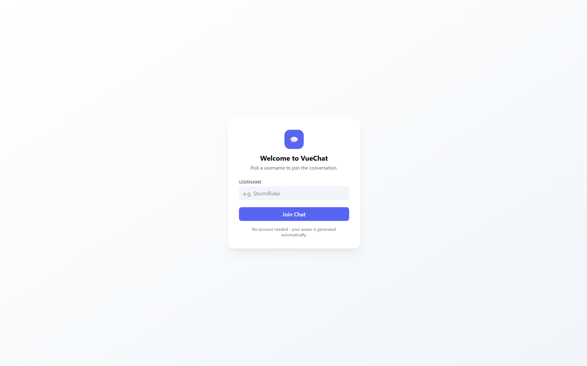
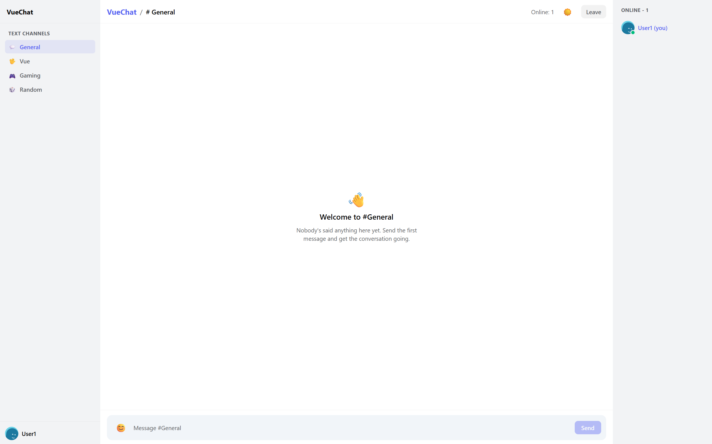
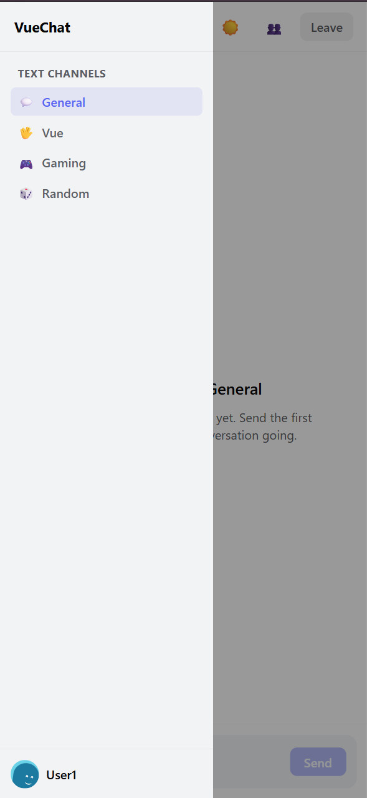
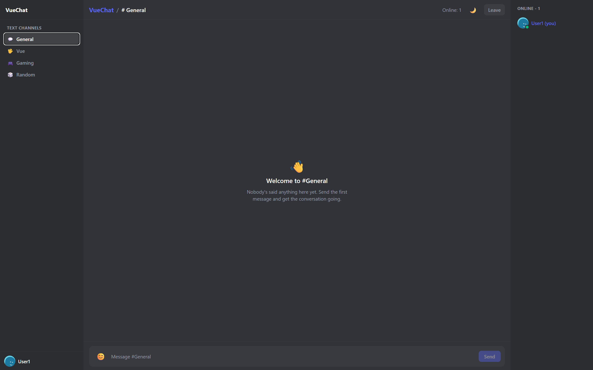

# VueChat 💬

A production-quality, Discord-inspired real-time chat application built with **Vue 3**, **Pinia**, **Tailwind CSS**, and **Socket.IO**.

> A modern full-stack chat application showcasing real-time communication, responsive UI design, and scalable frontend architecture using the Vue ecosystem.



<p align="center">


</p>

---

# 🌐 Live Demo

> **Frontend:** [Vercel](https://vue-chat-i2bw10b24-aidadaniyarovas-projects.vercel.app/chat)

> **Backend API:** [Render](https://vue-chat-p7ex.onrender.com)
---

# ✨ Features

- 🎨 Discord-inspired modern interface
- 💬 Distinct incoming and outgoing chat bubbles
- 👥 Live online user list with automatically generated avatars (DiceBear)
- 🏠 Multiple chat rooms with independent message history
- 😀 Emoji picker
- ⌨️ Live typing indicators
- 📜 Smart auto-scroll with new-message toast notifications
- 🕒 Message timestamps
- 🌙 Light & Dark mode (saved between visits)
- 📱 Fully responsive mobile layout with collapsible sidebars
- ⚡ Real-time communication powered by Socket.IO

---

# 📸 Screenshots

| Chat | Mobile | Dark Mode |
|------|--------|-----------|
|  |  |  |

---

# 🚀 Tech Stack

| Layer | Technology |
|--------|------------|
| Frontend | Vue 3, Vite, Vue Router |
| State Management | Pinia |
| Styling | Tailwind CSS v4 |
| Backend | Node.js, Express |
| Real-time | Socket.IO |
| Avatars | DiceBear API |
| Emoji Picker | emoji-picker-element |

---

# 📂 Project Structure

```text
vue-chat/
├── client/
│   ├── src/
│   │   ├── components/
│   │   ├── composables/
│   │   ├── router/
│   │   ├── stores/
│   │   ├── views/
│   │   ├── socket.js
│   │   ├── App.vue
│   │   ├── main.js
│   │   └── style.css
│   └── vite.config.js
│
└── server/
    ├── index.js
    └── rooms.js
```

---

# 🏗️ Architecture

```text
                Vue 3 Client
                      │
               Socket.IO Client
                      │
══════════════════════╪══════════════════════
                      │
             Express + Socket.IO
                      │
      ┌───────────────┼───────────────┐
      │               │               │
   Rooms         Online Users    Message History
      │               │               │
      └───────────────┴───────────────┘
              In-Memory Storage
```

---

# 🧠 What This Project Demonstrates

This project showcases several modern frontend and full-stack development concepts:

- Vue 3 Composition API
- Component-based architecture
- State management with Pinia
- Vue Router navigation
- Real-time communication using Socket.IO
- Responsive layouts with Tailwind CSS
- Dark mode persistence
- Reusable composables
- Event-driven application design
- Clean project organization

---

# ⚙️ Getting Started

## Requirements

- Node.js 18+
- npm

Clone the repository:

```bash
git clone https://github.com/AidaDaniyarova/vue-chat.git
cd vue-chat
```

Install all dependencies:

```bash
npm run install:all
```

Start both frontend and backend:

```bash
npm run dev
```

The application will start on:

Frontend

```
http://localhost:5173
```

Backend

```
http://localhost:3000
```

Open the frontend in two browser windows (or one normal window and one incognito window) to test real-time messaging.

---

# 💻 Running Frontend and Backend Separately

### Backend

```bash
cd server

npm install

npm run dev
```

### Frontend

```bash
cd client

npm install

npm run dev
```

---

# 🔐 Environment Variables

Copy the example environment files:

```bash
cp server/.env.example server/.env

cp client/.env.example client/.env
```

### Backend

```env
PORT=3000
CLIENT_ORIGIN=http://localhost:5173
```

### Frontend

```env
VITE_SOCKET_URL=http://localhost:3000
```

---

# ⚡ How It Works

### Rooms

Rooms are predefined on the server (`rooms.js`).

Each room is joined with

```js
socket.join(room)
```

Messages are broadcast only to users inside that room.

---

### Message History

The server stores the latest **50 messages per room** in memory.

When a user joins a room, the history is automatically replayed.

> Message history is temporary and resets whenever the server restarts.

---

### Presence

The server maintains:

```text
socket.id
        ↓
{ username, room }
```

Whenever someone joins, changes rooms, or disconnects, the updated online user list is broadcast to every client in that room.

---

### Typing Indicator

Typing events are sent to everyone else in the room (excluding the sender).

Indicators automatically disappear after **2 seconds** of inactivity.

---

### Avatars

User avatars are generated dynamically using the DiceBear API based solely on the username.

No image uploads or storage are required.

---

# 🚀 Deployment

## Backend (Render)

1. Push the repository to GitHub.
2. Create a new Render Web Service.
3. Set the root directory to:

```
server/
```

Build command

```bash
npm install
```

Start command

```bash
npm start
```

Environment variable

```env
CLIENT_ORIGIN=https://your-chat.vercel.app
```

---

## Frontend (Vercel)

1. Import the repository.
2. Set the root directory to:

```
client/
```

Framework preset

```
Vite
```

Environment variable

```env
VITE_SOCKET_URL=https://your-chat.onrender.com
```

Deploy.

---

# 📈 Future Improvements

Some ideas for extending the project:

- Store messages in MongoDB or PostgreSQL
- JWT authentication
- User accounts and profiles
- Direct messaging
- File & image sharing
- Read receipts
- Message editing and deletion
- Notifications
- Docker support
- Kubernetes deployment
- End-to-end encrypted private chats

---

# ⚠️ Current Limitations

- Messages are stored only in memory
- No authentication system
- Rooms are predefined
- No persistent database
- No file uploads
- No direct messaging

These limitations are intentional to keep the project focused on demonstrating real-time communication with Socket.IO and Vue 3.

---

# 🙏 Acknowledgements

This project uses several excellent open-source libraries:

- Vue.js
- Vite
- Pinia
- Socket.IO
- Tailwind CSS
- DiceBear
- emoji-picker-element

Special thanks to the Vue and open-source communities for maintaining these tools.

---

# 📄 License

This project is licensed under the **MIT License**.

Feel free to use, modify, and build upon it for learning or portfolio purposes.
